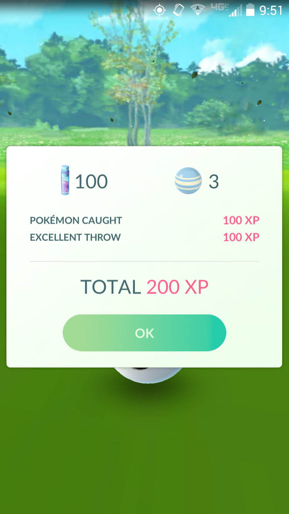

How to Catch Pokemon
=======================

Items
-------

Pokemon are all over all you need to do is walk around to find them! But once 
you find one what to you do? It’s easy, simply use your pokeballs to capture the pokemon. 

Besides the pokeball there are a lot more things that can be taken into 
consideration when catching Pokemon. As you level up in the game more 
items will be available that increase your chances of catching pokemon. 
The items and what level they are rewarded at are shown in the table below.

========== ==========
Item       Level
========== ==========
Poke Ball  1
Razz Berry 8
Great Ball 12
Ultra Ball 20
========== ==========

Bonuses
---------
Besides items you can also achieve different bonuses which can increase 
your chances of catching a pokemon. The first is to catch your pokemon 
with a curveball. To do this before throwing the pokeball simply shake it 
around a little until it starts to glow. Once it is glowing throw it at your 
pokemon in a curving motion. It's okay if you don't get the hang of it right away!

Other bonuses that can be achieved while catching your pokemon are getting 
nice, great, or excellent catches. To do this your pokeball has to hit the 
colored circle around your pokemon. The smaller the circle is when you hit 
it the better the catch. Besides increasing your chances of catching the 
pokemon these types of catches also give you more xp.

The last type of bonus is achieved by getting bronze, silver, or gold medals 
for catching different types of pokemon. If you have been playing Pokemon Go 
for awhile now you've probably already gotten some of these medals, but if 
you're just starting you will need to catch some more pokemon first. 

The table below shows how much each item and bonus will increase 
your chance of catching a pokemon.

============ ===========
Bonus Type   Multiplier
============ ===========
Razz Berry   1.5
Curveball    1.7
Catch        2-r
Poke Ball	 1.0
Great Ball   1.5
Ultra Ball   2.0
Bronze       1.1
Silver       1.2
Gold         1.3
============ ===========