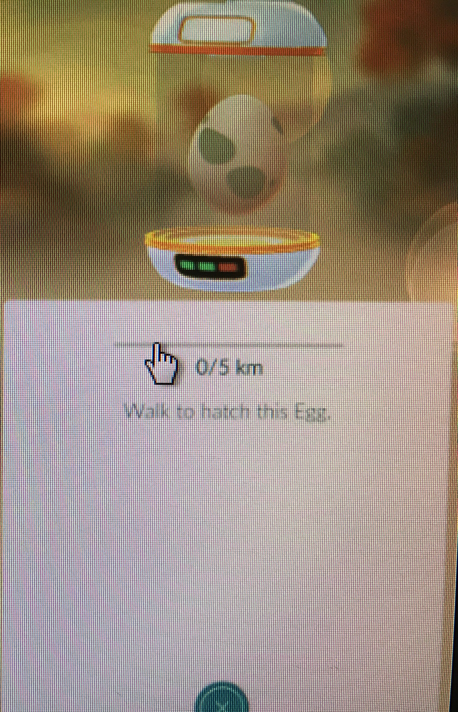
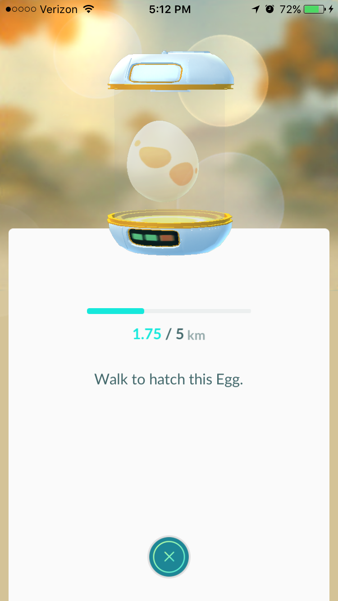

Hatching Eggs
=============

Types of Eggs
-------------

There are \ **three different types**\  of eggs in Pokemon Go. The most basic of the three are the 2KM eggs, 
which all have green spots on them.

The second type of eggs would be the 5KM ones, which have orange spots on them.

The third and final type of eggs are the 10KM ones, which have purple spots all around them.

.. image:: 10KM.JPG
	:align: center
	:height: 300
	:width: 200

In order to start the hatching process, you have to place the egg in an incubator, one egg per incubator. 
Every playes starts off with an incubator that can be used an unlimited amount of times. 
If you wish to have more incubators to try and hatch multiple eggs at the same time, 
you would either have to level up enough to recieve incubators as rewards or you would have to go to the in-game store and buy more. 
Each of these additonal incubators will work for only three uses, then will become unusable. Once in the incubator, 
you must walk the specified amount of kilometers in order for the egg to hatch.

Types of Pokemon From Eggs
--------------------------

========== ========== ==========
2KM        5KM        10KM
========== ========== ==========
Bulbasaur  Ekans      Onix
Charmander Sandshrew  Hitmonlee
Squirtle   Nidoran♂   Hitmonchan
Caterpie   Nidoran♀   Chansey
Weedle     Vulpix     Scyther
Pidgey     Oddish     Jynx
Rattata    Paras      Electabuzz
Spearow    Venonat    Magmar
Pikachu    Diglett    Pinsir
Clefairy   Meowth     Lapras
Jigglypuff Psyduck    Eevee
Zubat      Mankey     Omanyte
Geodude    Growlithe  Kabuto
Magikarp   Poliwag      -
   -       Abra         -
   -       Machop       -
   -       Bellsprout   -
   -       Tentacool    -
   -       Ponyta       -
   -       Slowpoke     -
   -       Magnemite    -
   -       Farfetch'd   -
   -       Doduo        -
   -       Seel         -
   -       Grimer       -
   -       Shellder     -
   -       Gastly       -
   -       Drowzee      -
   -       Krabby       -
   -       Voltorb      -
   -       Exeggute     -
   -       Cubone       -
   -       Lickitung    -
   -       Koffing      -
   -       Rhyhorn      -
   -       Tangela      -
   -       Kangaskhan   -
   -       Horsea       -
   -       Goldeen      -
   -       Staryu       -
   -       Mr. Mime     -
   -       Tauros       -
   -       Porygon      -
========== ========== ==========

To see the evolutions of all of these pokemon that can hatch from eggs, visit this page: file:///F:/CIS%20120/Pokemon%20Go/build/html/evolutions/evolutions.html