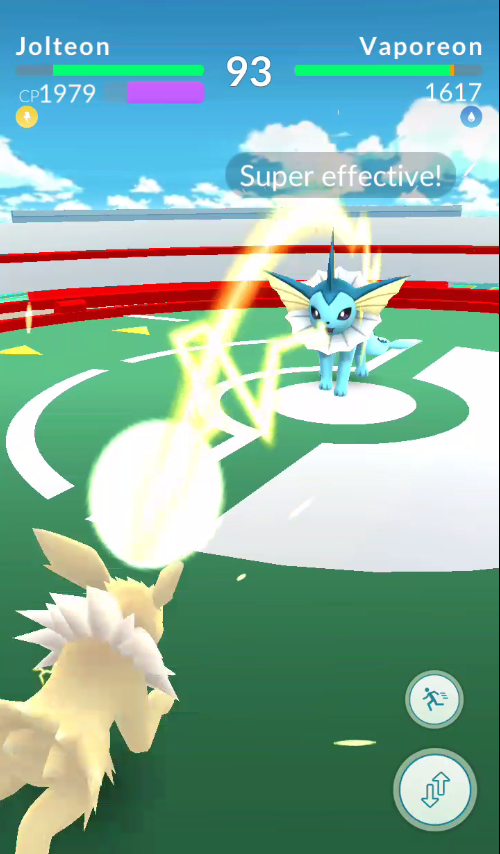
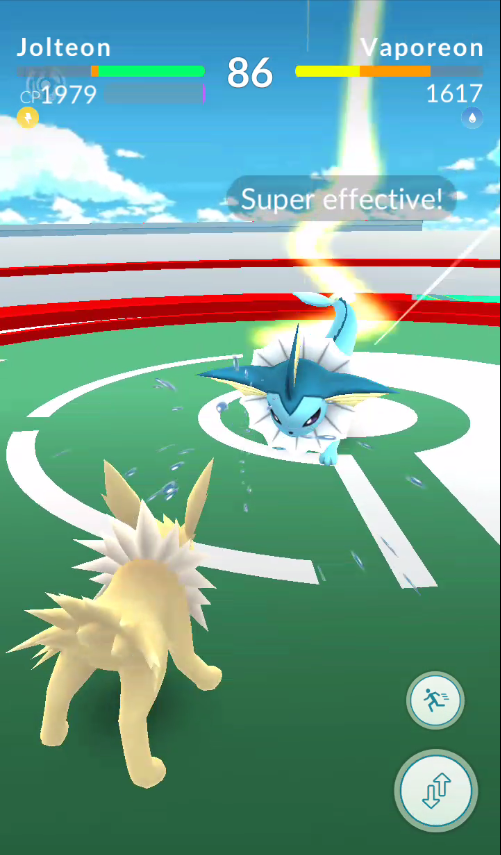
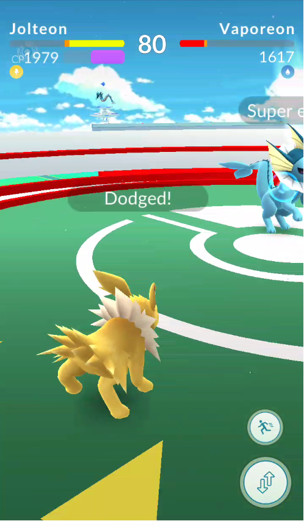
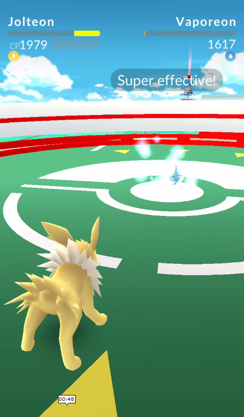
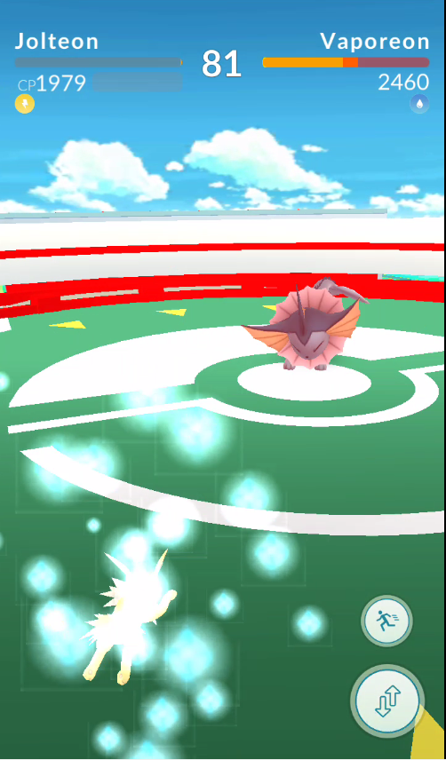

Gyms
======

.. _intro-to-gyms-ref:

Intro to Gyms
-------------
Battling and catching wild Pokemon is what the series is famous for.  
However, you don’t battle wild Pokemon in Pokemon Go; you simply catch them.  
If you want to battle, you have to battle at the **Gyms**.  
A gym is a location corresponding to a local landmark, 
typically parks or important buildings, where players can put their Pokemon.  
In order to do this, however, you have to kick out any opposing teams 
(Valor, Mystic, or Instinct). The level corresponds to the number of Pokemon 
that can be put into it by the controlling team.  
When a Pokemon is put into a gym, the gym gains 500 **Prestige**.
The amount of Prestige a gym has indicates its level.

============= ================= ===============
Level Number  Minimum Prestige  Number of Slots
============= ================= ===============
1             0                 1
2             2000              2
3             4000              3
4             8000              4
5             12000             5
6             16000             6
7             20000             7
8             30000             8
9             40000             9
10            50000             10
============= ================= ===============

When you battle an opposing team in their gym,
you face off against their Pokemon in order of Combat Points.  
You fight the Pokemon with the lowest **CP** first, 
and work your way to the highest CP Pokemon in the gym. 
You use up to 6 Pokemon for these battles.  
If you defeat the gym, the **Prestige** of their gym drops equal to one level
and their lowest CP Pokemon is kicked out of the gym.  
You do this until you’ve defeated them when they’re at Level 1, 
in which case they are kicked out and you can put your own Pokemon in
to claim the gym.

.. _battling-gym-ref:

How To Battle A Gym
-------------------
To battle a gym, tap the gym while being within range of the gym; 
the ring that expands out from your avatar will indicate whether 
or not you are in range of the gym.  Then choose the six Pokemon you want
to battle with; make sure to choose Pokemon that have a type advantage against 
the Pokemon in the gym (see the Strategies page for details).  To start the
battle, tap **Go**.  During the battle, tap the screen to use your Pokemon's
primary attack and hold your finger on the screen to use its secondary attack.
There will be a bar at the top of the screen to indicate whether your
Pokemon is ready to use its secondary attack; it fills as your Pokemon uses
its primary attacks and takes damage.  Swipe on the screen to dodge
the opponent's attacks and significantly decrease
the damage you take from them. When you damage the opposing Pokemon enough,
it will faint and be replaced by the next weakest Pokemon in the gym
until there are no more.

*This is an example of a Pokemon's primary attack: Jolteon's Thundershock.*

*This is an example of a Pokemon's secondary attack: Jolteon's Thunder.*

*Here the Jolteon has just dodged the opposing Vaporeon's secondary attack.*

*The opposing Vaporeon has fainted and is being replaced by another Pokemon.*

*The second Vaporeon got the better of our noble but weakened Jolteon.*

.. _training-gym-ref:

Training Gyms
-------------
Each player on a specific team can only put one Pokemon into the gym,
no matter what level the gym is.  
In order to level up the gym and allow more people to put
their Pokemon into the gym, you have to train at the gym.  
This is essentially the same as battling at an opposing team’s gym,
except the gym gains prestige instead of losing it, 
and the CP of the Pokemon you use actually matters for the change in prestige.
Also, the change in prestige won’t be sufficient to change 
the level of the gym by 1 every time, typically.  
You can accelerate the training process by using lower CP Pokemon
to train the gym, since the gym gets more prestige when you defeat Pokemon
in the gym with lower CP Pokemon 
than if you were training with extremely high CP Pokemon.
Each level of a gym takes a different amount of prestige, 
with the max level being 10.
   
.. _gyms-why-bother-ref:

Gyms: Why Bother?
-----------
Once you have put a Pokemon in the gym, 
you can collect coins in the shop for being in the gym.  
However, you can only do this once every 21 hours, 
and the coins are collected for all gyms you are in at the same time:
10 coins each.  These coins can then be used to buy in-game items, 
which are discussed here: :ref:`type-advantage-chart`