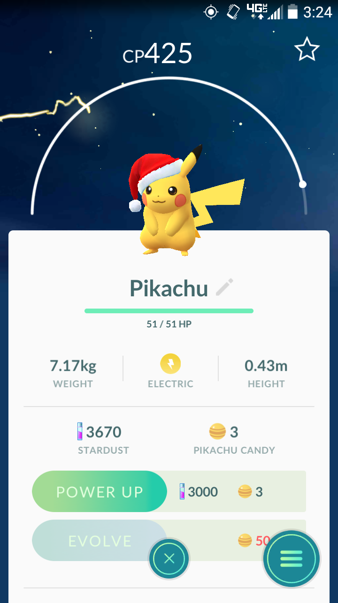
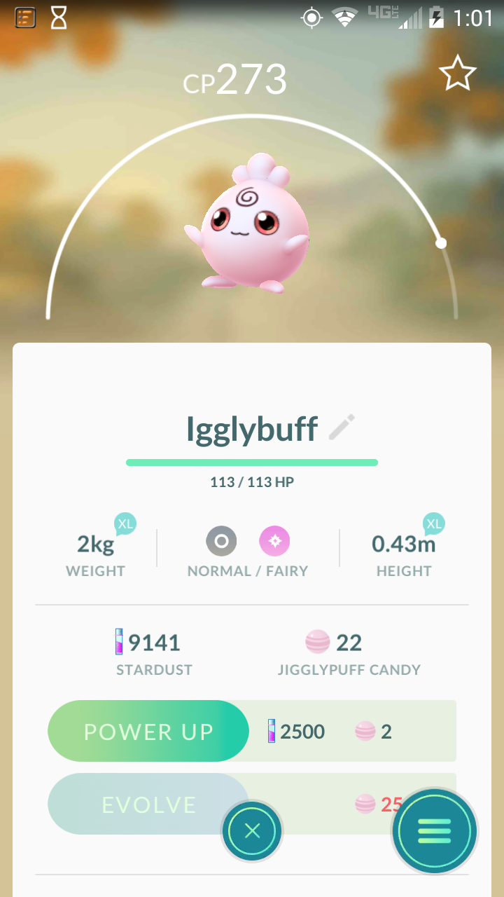

Updates
==========

Christmas Update
-----------------
The much anticipated Christmas event is finally here! Players can now 
find a festive Pikachu wearing a Santa hat in the wild! It has also 
been said that if you evolve your festive Pikachu that Raichu will 
still be wearing the Santa hat.

Besides the festive Pikachu Niantic has also added baby pokemon! So far 
players have confirmed that seven baby pokemon have been added to the 
game. These include Igglybuff, Cleffa, Pichu, Togepi, Smoochum, Elekid, 
and Magby. The only way to catch these adorable babies is by hatching eggs.
Igglybuff and Cleffa can be found in 2k eggs, Pichu and Togepi in 5k eggs,
and Smoochum, Elekid, and Magby in 10k eggs.

Ditto is here!
---------------

All Pokemon goers have rejoiced since Niantics latest update. Ditto is finally 
available for users to catch, but there’s a catch. Users won’t know if they’re 
catching Ditto until he’s been caught. Ditto’s main power is transform which means 
he can transform into any other pokemon that he sees. So stop ignoring those 
pesky Rattatas and Pidgeys because Ditto is most commonly being found hiding as them. 

Once you catch a Ditto be sure to use him in all of your gym battles because 
Ditto will transform into the first pokemon he sees. Not only will Ditto 
transform into his opponent, but his CP will also increase! Ditto’s CP 
will be his current CP plus half of his opponents CP.

Updated Tracker
----------------
Niantic has also updated the pokemon tracker. Before the updated the tracker 
just showed pokemon sightings around you. Now the tracker will show which 
pokestops the nearby pokemon are at. With this update it will be easier to 
find pokemon in the tracker, but if there is a pokemon not near a pokestop 
it won’t show up in the tracker. Many users are upset about this tracker 
because they can no longer see all the pokemon in the area.
 
It seems the tracker has been changing frequently so we will just have 
to wait and see what Niantic chooses to do with it next. 